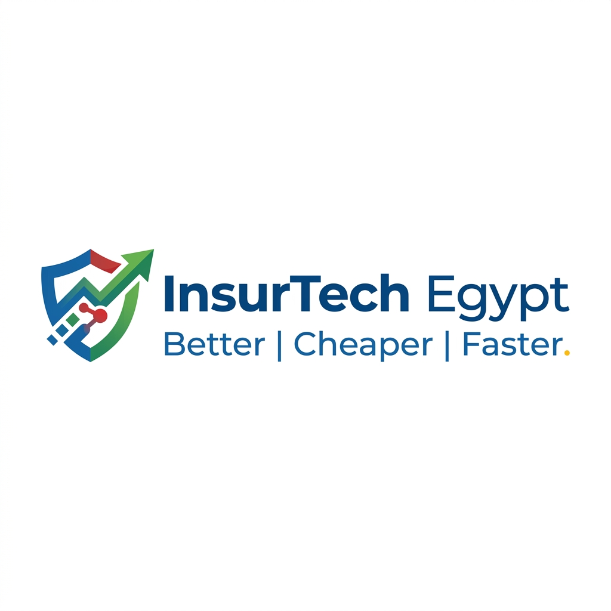
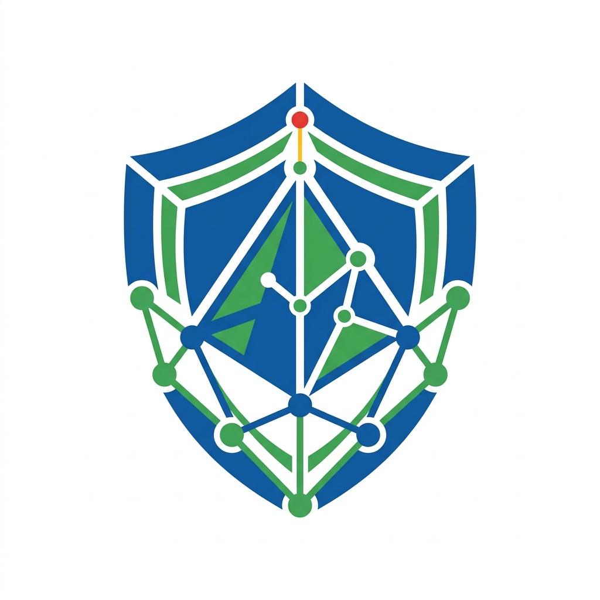
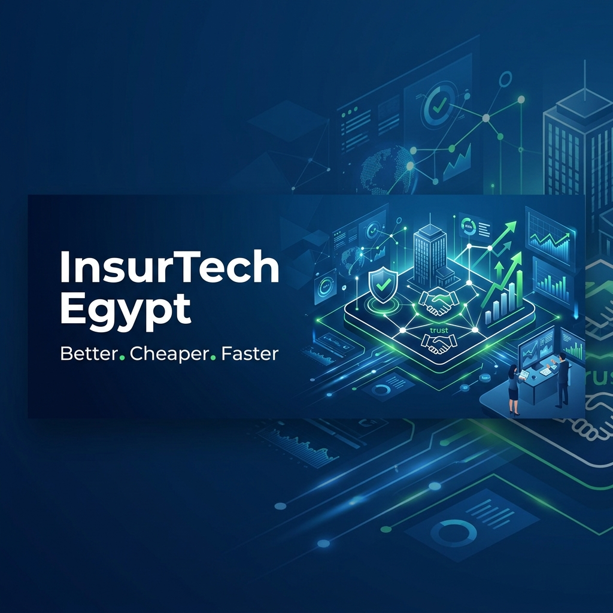
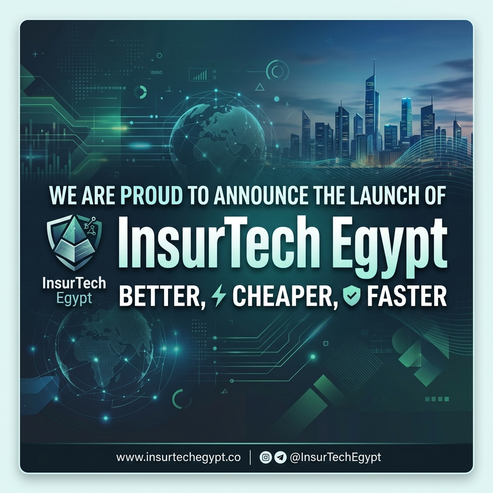

# InsurTech-Egypt — Visual Identity & Brand Guidelines

## Core Identity
**Company Name:** InsurTech-Egypt
**Slogan:** Better, Cheaper, Faster
**Positioning:** A technology company focused on building modern insurance systems and digital transformation solutions, delivering high-performance, scalable platforms.

---

## 1. Brand Color Palette

The color strategy uses trust-oriented cool colors combined with action-oriented bright accents, striking a professional corporate balance.

### Primary Dominant Color
**Trust Blue**
- **HEX:** `#003B73`
- **RGB:** `0, 59, 115`
- *Usage:* Primary color for backgrounds, strong headings, main logo elements, and establishing a secure, technology-driven enterprise feel.

### Secondary Color
**Efficiency Green**
- **HEX:** `#00A859`
- **RGB:** `0, 168, 89`
- *Usage:* Growth, positive actions, operational efficiency, and secondary highlighting.

### Accent Colors
**Speed & Innovation Red**
- **HEX:** `#E63946`
- **RGB:** `230, 57, 70`
- *Usage:* Strictly for accents. Alerts, notifications, and representing speed.

**Value Yellow**
- **HEX:** `#F4A261`
- **RGB:** `244, 162, 97`
- *Usage:* Very limited usage for minor highlights representing cost-effectiveness and value.

---

## 2. Typography Recommendations

The typography should reflect a modern, clean, and readable B2B enterprise style. 

### Primary Font
**Inter** (or **Roboto**)
- *Usage:* Logo text, primary headings, primary navigation.
- *Weight:* Bold (700) for the company name, Semibold (600) for section headings.

### Secondary Font
**Outfit** (or **Open Sans**)
- *Usage:* Body text, paragraphs, SLA reports, the "Better, Cheaper, Faster" slogan.
- *Weight:* Medium (500) for the slogan, Regular (400) for standard body copy.

---

## 3. Deliverables Asset Pack

The physical visual assets generated have been structured into the `Branding_Material` core folders:

### Logos
Located in `../Logos/`
- **`main_logo.png`**: The primary horizontal layout of the InsurTech-Egypt logo with the exact slogan positioned underneath.
- **`brand_icon.png`**: A minimal, highly recognizable digital shield/node concept focusing entirely on the visual mark.

### Social Media & Print
Located in `../Social_Media/`
- **`linkedin_banner.png`**: 1584x396px ratio exact banner, styled in deep corporate blues. Features the company title and slogan for professional networking platforms.
- **`announcement_image.png`**: A launch-ready graphic with executive-level polished high-contrast readability.

---

## Quality Rules applied:
1. **Design Theme:** No cartoons or playful styles. Maintained enterprise-grade and tech-driven structure.
2. **Readability:** Sharp contrast across all branding assets.
3. **Core Concept:** Elements of trust, digital networks, speed, and modern insurance protection visually infused into the designs.
